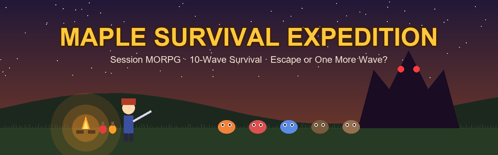
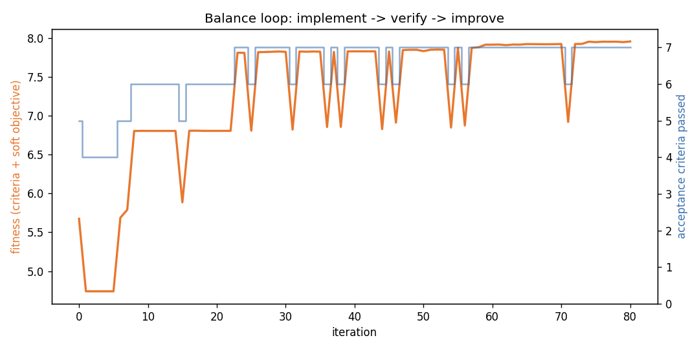
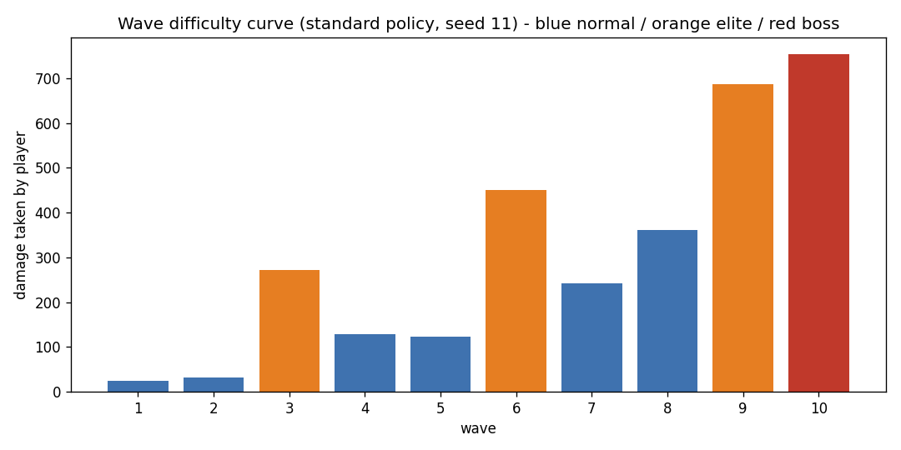
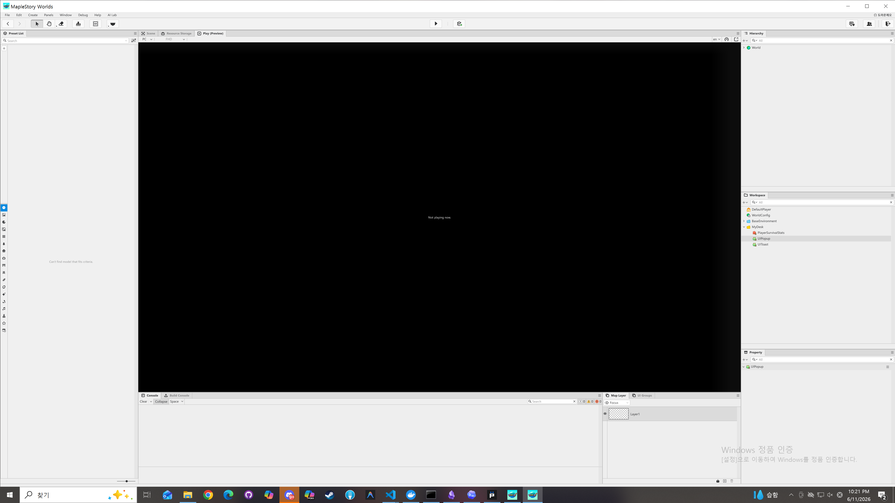
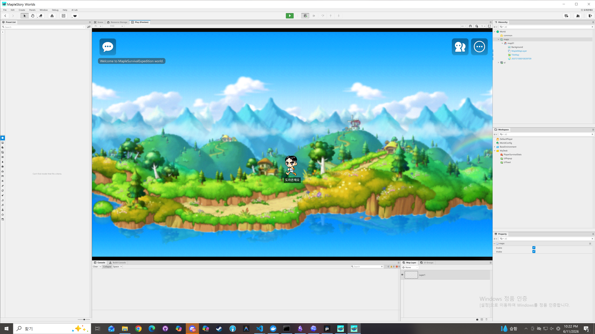

# Maple Survival Expedition (메이플 생존 원정대)




## 게임 소개

**Maple Survival Expedition**은 메이플스토리 월드(MSW) 엔진으로 만든 **세션형 서바이벌 MORPG**입니다.
메이플 월드의 사냥·성장·몬스터 수집·장비 파밍을 *"위험 지역에서 오래 살아남고 더 깊이 진입하는 원정"*으로 재해석했습니다.

핵심 의사결정은 단 하나로 고정됩니다 — **"지금 탈출할까, 한 웨이브 더 갈까?"**

- **장르** — 세션형 MORPG + 서바이벌 성장 + 비동기 랭킹 경쟁
- **세션 길이** — 5~12분 (표준 플레이 기준 검증값 약 9.3분)
- **핵심 루프** — 입장 → 사냥/생존 자원 관리 → 엘리트/보스 이벤트 → 탈출 또는 전멸 → 보상 정산 → 영구 성장

### 콘텐츠

| 시스템 | 내용 |
|---|---|
| **10웨이브 원정** | normal ×6, **elite** ×3 (웨이브 3/6/9, 엘리트 골렘 난입), **boss** ×1 (웨이브 10, 발록) |
| **몬스터 7종** | 달팽이 → 버섯 → 슬라임 → 스텀프 → 와일드보어 → 엘리트골렘 → 보스발록, 타입별 HP/공격력/경험치 |
| **위험도 게이지** | 웨이브 진행에 따라 몬스터 공격력·체력 증가. 위험도 50% 초과 시 엘리트 등장 |
| **탈출 선택** | 웨이브 클리어 후 휴식 페이즈에 탈출 창 개방 — 탈출하면 보상 100% 확정, 전멸하면 40%만 보존 |
| **생존 자원** | 포션·식량 드랍/자동 사용, 허기·기아 피해, 휴식 페이즈 캠프파이어 회복 |
| **몬스터 도감** | 최초 처치 시 도감 등록, 엔트리당 영구 공격력 +%·최대 체력 보너스 |
| **계정 메타** | 세션 점수 → 계정 경험치 정산 (탈출/클리어/전멸 보존율 차등) |
| **데이터 주도 밸런스** | 모든 수치는 `balance_table.json` 단일 SSOT → `BalanceTable.lua` 자동 생성 |

## 검증된 밸런스 (ralph loop: 구현 → 검증 → 개선)

밸런스는 손튜닝이 아니라 **자동 반복 루프 260+회**(60+60+60+80, 마지막 라운드 80회)로 수렴시켰습니다.
매 반복은 3개 플레이 정책 × 3개 시드 = 9회의 결정론적 세션 시뮬레이션으로 7개 수용 기준을 검사합니다.



| 수용 기준 | 결과 |
|---|---|
| AC2 — 표준 플레이는 보스 포함 10웨이브 완주, 사망 0 | **PASS** (3/3 시드 클리어) |
| AC3 — 세션 길이 300~720초 | **PASS** (556초 ≈ 9.3분) |
| AC4 — 신중 플레이는 안전 탈출 + 보상 확보 | **PASS** (3/3 escaped) |
| AC5 — 탐욕 플레이는 실제 위험 부담 (최저 체력 < 55%) | **PASS** (최저 체력 25.1%) |
| AC6 — 난이도 단조 증가 (후반 웨이브가 더 아프다) | **PASS** |
| AC7 — 표준 플레이 중 도감 4종 이상 발견 | **PASS** (7/7종) |
| AC8 — 계정 메타 정산 동작 | **PASS** |



전체 반복 기록: [`BALANCE_LOOP_REPORT.md`](BALANCE_LOOP_REPORT.md) · 원본 로그: `balance_loop_log.json`

## 엔진 실행 증거

MSW Maker에서 월드 생성·스크립트 등록·Play Preview 실행을 검증했습니다.

| | |
|---|---|
|  |  |

상세: [`ENGINE_RUN_REPORT.md`](ENGINE_RUN_REPORT.md)

## 파일 구성

| 파일 | MSW 역할 | 부착 대상 |
|---|---|---|
| `BalanceTable.lua` | Logic (자동 생성) | `/maps/map01/BalanceTable` |
| `SurvivalGameManager.lua` | Logic | `/maps/map01/SurvivalGameManager` |
| `PlayerSurvivalStats.lua` | Component | `DefaultPlayer` |
| `MonsterSpawner.lua` | Component | `/maps/map01` 아래 스폰 포인트 |
| `MonsterAgent.lua` | Component | 몬스터 모델 프리팹 |
| `MonsterCollection.lua` | Logic | `/maps/map01/MonsterCollection` |
| `SurvivalHudBridge.lua` | Component | UI 매니저 엔티티 |
| `balance_table.json` | 밸런스 SSOT | 저장소 (수정 후 `gen-lua`) |
| `tools/msw_project_cli.py` | 검증/시뮬레이션/루프 하니스 | 로컬 CLI |

## 로컬 검증 명령

```bash
python tools/msw_project_cli.py validate                      # MSW 스크립트 구조 검증
python tools/msw_project_cli.py expedition --policy standard  # 단일 세션 시뮬레이션 (JSON)
python tools/msw_project_cli.py evaluate                      # 7개 수용 기준 평가
python tools/msw_project_cli.py balance-loop --iterations 80  # ralph 루프 (구현→검증→개선)
python tools/msw_project_cli.py gen-lua                       # balance_table.json → BalanceTable.lua
python tools/msw_project_cli.py charts                        # 밸런스 차트 렌더링
python tools/msw_project_cli.py launch-engine                 # MSW Maker 실행 확인
```

`ouroboros` MCP 서버는 `.mcp.json`에 등록되어 있어 ralph 서브에이전트 루프
(`ouroboros_execute_seed` / `ouroboros_evaluate` 등 23개 도구)를 에이전트 런타임에서 바로 사용할 수 있습니다.

## MSW Maker 적용 절차

1. MSW Maker 실행: `D:\MapleStory Worlds\msw.exe` → 월드 열기/생성
2. Workspace에 7개 스크립트 생성 후 각 `.lua` 내용 붙여넣기
3. 부착: 위 표의 부착 대상 참조. `MonsterSpawner.MonsterModelId`에 Resource Storage의 몬스터 모델 Entry ID 설정 (비우면 로그 전용 시뮬레이션 스폰)
4. Play 후 Console에서 `[MapleSurvivalExpedition]` 로그 확인

## 기획 문서

콘테스트 출품 기획·리소스 전략은 [`docs/join_develop.md`](docs/join_develop.md) 참조
(메이플스토리 글로벌 개발 콘테스트 2026 — IP 해석 40% / 완성도 40% / 지속 가능성 20% 직접 겨냥).

## License

MIT. 리메이크 리소스 참조(`docs/resource/`)는 [MSW-Git/MSWRemake](https://github.com/MSW-Git/MSWRemake) (MIT) 기반.
