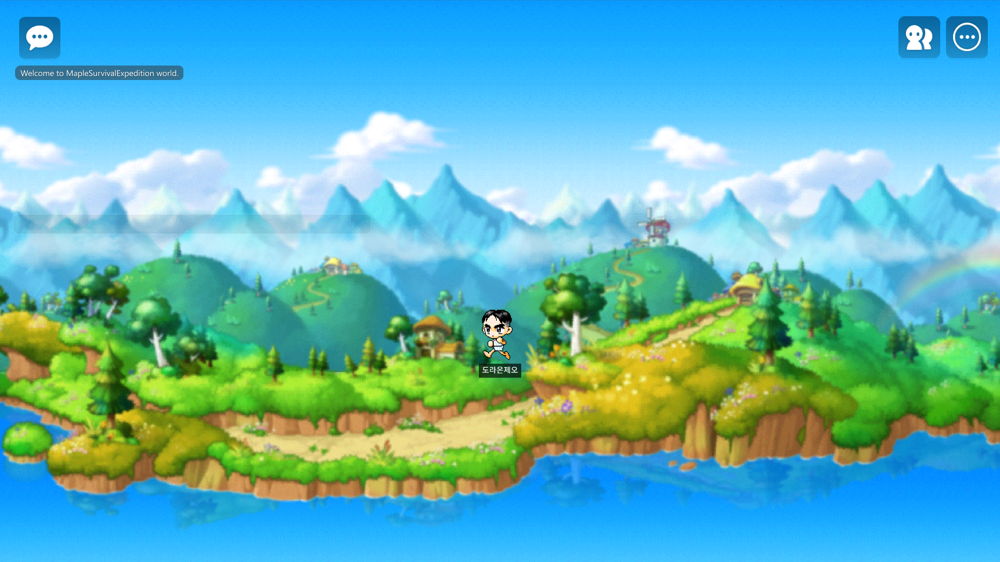
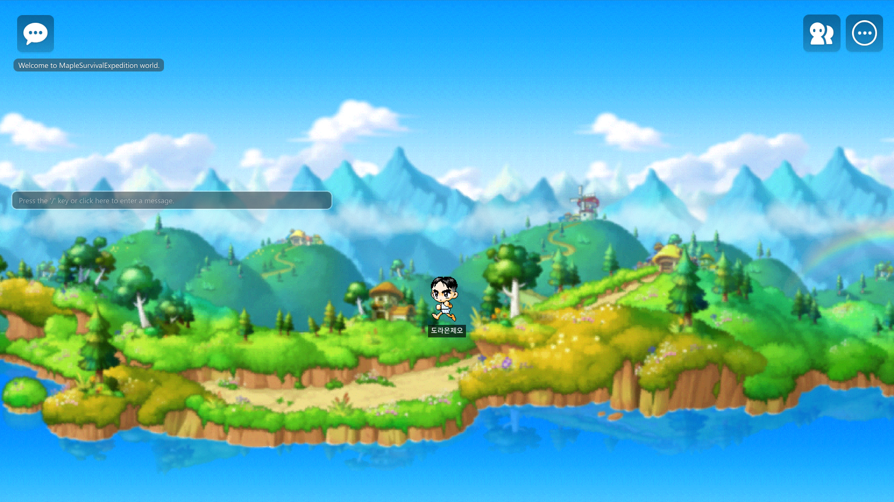
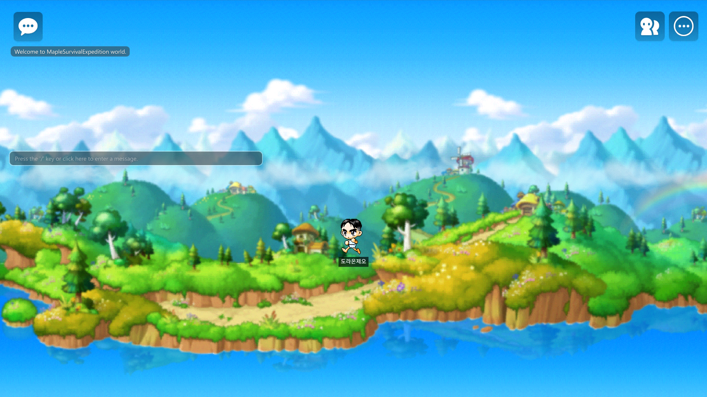

# Maple Survival Expedition · 메이플 생존 원정대


> **Release Candidate v0.2.0-ralph-resource** — MapleStory Worlds LocalWorkspace에서 실행되는 월드, 공식 MSW Maker MCP Play Test, 260+회 밸런스 반복, `docs/resource` 기획 스크립트/리소스 9개 패킷 연동, 7/7 수용 기준 통과 증거를 포함한 세션형 서바이벌 MORPG 프로토타입입니다.

## 실행 화면

MSW Maker LocalWorkspace를 이 저장소에 연결한 뒤 `maker_refresh_workspace` → `maker_play` → `maker_screenshot`으로 캡처한 실제 Play 화면입니다. 세 번째 이미지는 ralph 재검증으로 추가한 **docs/resource 기획 스크립트/리소스 연동** 실동작 캡처입니다.

| Workspace Play | Map-attached Gameplay | Resource-linked Ralph Verification |
|---|---|---|
|  |  |  |

| 실행 증거 | 결과 |
|---|---:|
| Maker MCP 연결 도구 | 15개 |
| Build Console | 0 errors |
| Runtime Console | 623 resource/playable logs |
| Map-attached gameplay entities | 7개 |
| docs/resource packets | 9개 패킷 / 294개 파일 |
| 직접 상태 조회 | `wave=10`, `outcome=cleared`, `resourceReady=true`, `collection=7`, `accountExp=559` |
| 최종 평가 | 7/7 PASS + resource-linkage PASS |

상세 증거: [`RALPH_RESOURCE_LINKAGE_VERIFICATION.md`](RALPH_RESOURCE_LINKAGE_VERIFICATION.md) · [`MSW_PLAYABLE_REVIEW_VERIFICATION.md`](MSW_PLAYABLE_REVIEW_VERIFICATION.md) · [`MSW_MCP_VERIFICATION.md`](MSW_MCP_VERIFICATION.md) · [`ENGINE_RUN_REPORT.md`](ENGINE_RUN_REPORT.md)

## 게임 소개

**Maple Survival Expedition**은 메이플스토리 월드의 사냥, 성장, 몬스터 도감, 아이템 파밍을 **짧고 반복 가능한 생존 원정 세션**으로 재구성한 MORPG입니다.

핵심 질문은 한 문장입니다.

> **지금 탈출해서 보상을 확정할까, 한 웨이브 더 버텨 더 큰 보상을 노릴까?**

- **장르**: 세션형 MORPG + 서바이벌 성장 + 비동기 랭킹 경쟁
- **플랫폼/엔진**: MapleStory Worlds / MSW Maker
- **세션 목표**: 5~12분 안에 10웨이브 원정, 엘리트전, 보스전, 보상 정산까지 완료
- **현재 검증값**: 표준 정책 556초, 보스 포함 10웨이브 클리어, 사망 0
- **운영 방향**: 주간 시즌 랭킹, 신규 몬스터/지역/룬 조합, 커뮤니티 챌린지

## 릴리즈 하이라이트

| 영역 | 포함 내용 |
|---|---|
| **월드 실행** | MSW Maker LocalWorkspace 저장소 연결, ExtendedScriptFormat 활성화, Play Test 실행 및 캡처 |
| **실동작 개선** | 리뷰 후 `map/map01.map`에 6개 gameplay entity를 배치하고 실제 컴포넌트 실행 로그로 검증 |
| **리소스 연동** | `docs/resource`의 Battle/Stage/Ranking/Miner/Collection/Dataset/UI/Map 패킷을 `ExpeditionResourceCatalog`로 실제 월드에 연결 |
| **세션 구조** | normal 6웨이브, elite 3웨이브, boss 1웨이브로 구성된 10웨이브 원정 |
| **보스 콘텐츠** | Wave 10 `BossBalrog` 진입, spawn, 처치, 클리어 로그 검증 |
| **도감/성장** | 7종 몬스터 도감 등록, 레벨업, 계정 경험치 정산 로그 검증 |
| **생존 자원** | 체력, 허기, 포션, 식량, 휴식 회복, 탈출/전멸 보존율 설계 |
| **밸런스 루프** | ralph 방식 구현→검증→개선 260+회, 최종 7/7 PASS |
| **GitHub 패키징** | 배너, 실행 화면, 밸런스 차트, 검증 리포트, MCP 설정 포함 |
| **MCP 재검증** | Maker MCP로 refresh → build log 0 → play → screenshot → server query → stop/save까지 재실행 |

## 핵심 게임 루프

```text
로비/준비
  ↓
위험 지역 입장
  ↓
사냥 · 생존 자원 관리 · 도감 등록
  ↓
엘리트 웨이브 / 보스 웨이브
  ↓
탈출 선택 또는 추가 진입
  ↓
보상 정산 · 계정 성장 · 랭킹/시즌 목표 갱신
```

### 콘텐츠 구성

| 시스템 | 기획 / 동작 |
|---|---|
| **10웨이브 원정** | 1~2 normal, 3 elite, 4~5 normal, 6 elite, 7~8 normal, 9 elite, 10 boss |
| **몬스터 7종** | Snail, Mushroom, Slime, Stump, WildBoar, EliteGolem, BossBalrog |
| **위험도 게이지** | 웨이브 시간이 흐를수록 피해 압박 증가, 탐욕 플레이에 실제 리스크 부여 |
| **탈출 선택** | 신중 플레이는 안전 탈출, 표준 플레이는 클리어, 탐욕 플레이는 체력 저점으로 위험 검증 |
| **자원 관리** | 포션/식량 자동 사용, 허기 감소, 휴식 페이즈 회복 |
| **몬스터 도감** | 최초 처치 시 등록, 도감 수집 기반 영구 성장 확장 가능 |
| **계정 메타** | 세션 점수 → account EXP 정산, 시즌/랭킹 확장 기반 |
| **데이터 밸런스** | `balance_table.json` 단일 SSOT에서 `BalanceTable.lua` 생성 |

## 검증된 밸런스

밸런스는 손튜닝이 아니라 **자동 반복 루프 260+회**로 수렴시켰습니다. 매 반복은 3개 플레이 정책 × 3개 시드 = 9회의 결정론적 세션 시뮬레이션으로 수용 기준을 검사합니다.


| 수용 기준 | 결과 |
|---|---|
| AC2 — 표준 플레이는 보스 포함 10웨이브 완주, 사망 0 | **PASS** |
| AC3 — 세션 길이 300~720초 | **PASS** — 556초, 약 9.3분 |
| AC4 — 신중 플레이는 안전 탈출 + 보상 확보 | **PASS** |
| AC5 — 탐욕 플레이는 실제 위험 부담 | **PASS** — 최저 체력 25.1% |
| AC6 — 난이도 단조 증가 | **PASS** |
| AC7 — 도감 4종 이상 발견 | **PASS** — 7/7종 |
| AC8 — 계정 메타 정산 | **PASS** |


전체 반복 기록: [`BALANCE_LOOP_REPORT.md`](BALANCE_LOOP_REPORT.md) · 원본 로그: [`balance_loop_log.json`](balance_loop_log.json)

## 기술 구성

| 레이어 | 파일 / 경로 | 역할 |
|---|---|---|
| **Map-attached Manager** | `RootDesk/MyDesk/MapleSurvivalExpedition/SurvivalGameManager.mlua` | `/maps/map01/SurvivalGameManager`에 붙는 실제 진행 컨트롤러 |
| **Map-attached Spawner** | `RootDesk/MyDesk/MapleSurvivalExpedition/MonsterSpawner.mlua` | `/maps/map01/MonsterSpawner`에서 웨이브별 몬스터 spawn/defeat 로그 발생 |
| **Map-attached Balance** | `RootDesk/MyDesk/MapleSurvivalExpedition/BalanceTable.mlua` | `/maps/map01/BalanceTable`에서 웨이브/몬스터 수치 제공 |
| **Map-attached Collection** | `RootDesk/MyDesk/MapleSurvivalExpedition/MonsterCollection.mlua` | `/maps/map01/MonsterCollection`에서 도감 7종 등록 검증 |
| **Player State Probe** | `RootDesk/MyDesk/PlayerSurvivalStats.mlua` | `/maps/map01/PlayerSurvivalProbe`에서 HP/EXP/score/death 상태 검증 |
| **HUD Bridge** | `RootDesk/MyDesk/MapleSurvivalExpedition/SurvivalHudBridge.mlua` | `/maps/map01/SurvivalHudBridge`에 붙는 HUD 상태 브리지 |
| **Resource Catalog** | `RootDesk/MyDesk/MapleSurvivalExpedition/ExpeditionResourceCatalog.mlua` | `/maps/map01/ExpeditionResourceCatalog`에서 `docs/resource` 기획 스크립트/리소스 패킷과 웨이브별 source route 제공 |
| **MCP Runtime Harness** | `RootDesk/MyDesk/MapleSurvivalExpedition/MapleSurvivalExpeditionRuntime.mlua` | Maker Play Test 보조 검증용 `@Logic` |
| **Map** | `map/map01.map` | gameplay/resource entity 7개가 배치된 MSW 월드 기본 맵 |
| **UI Groups** | `ui/*.ui` | Default/Popup/Toast UI 그룹 |
| **Balance SSOT** | `balance_table.json` | 밸런스 원본 데이터 |
| **Generated Logic** | `BalanceTable.lua` | 밸런스 데이터에서 생성되는 루트 참고 스크립트 |
| **Simulation Harness** | `tools/survival_sim.py` | 정책/시드 기반 세션 평가 |
| **Project CLI** | `tools/msw_project_cli.py` | validate/evaluate/resource-linkage/balance-loop/charts 실행 |
| **Resource Evidence** | `RALPH_RESOURCE_LINKAGE_VERIFICATION.*`, `RESOURCE_LINKAGE_VERIFICATION.json` | docs/resource 패킷, wave route, Maker MCP 직접 조회 증거 |
| **MCP Evidence** | `MSW_PLAYABLE_REVIEW_VERIFICATION.*`, `MSW_MCP_VERIFICATION.*` | Maker MCP 도구, 빌드 로그, 런타임 로그 증거 |

## 검증 명령

```bash
python tools/msw_project_cli.py validate
python tools/msw_project_cli.py evaluate
python -c "import json; d=json.load(open('MSW_MCP_VERIFICATION.json', encoding='utf-8')); assert d['build_logs']['count']==0; assert all(d['runtime_checks'].values()); assert d['execute_script']['dispatched']; print('MSW MCP evidence: PASS')"
python -c "import json; d=json.load(open('MSW_PLAYABLE_REVIEW_VERIFICATION.json', encoding='utf-8')); assert d['all_passed']; print('MSW playable evidence: PASS')"
python tools/msw_project_cli.py resource-linkage
python -c "import json; d=json.load(open('RALPH_RESOURCE_LINKAGE_VERIFICATION.json', encoding='utf-8')); assert d['all_passed']; assert d['checks']['query_confirms_resource_ready']; print('ralph resource linkage evidence: PASS')"
```

추가 작업용 명령:

```bash
python tools/msw_project_cli.py expedition --policy standard
python tools/msw_project_cli.py balance-loop --iterations 80
python tools/msw_project_cli.py gen-lua
python tools/msw_project_cli.py charts
python tools/msw_project_cli.py launch-engine
```

## MSW Maker / MCP 실행 절차

1. MSW Maker 실행: `D:\MapleStory Worlds\msw.exe`
2. 월드 `MapleSurvivalExpedition` 열기
3. AI ToolKit Settings에서 **LocalWorkspace**와 **ExtendedScriptFormat** 활성화
4. Save Folder를 이 저장소 루트로 지정
5. `.mcp.json` 또는 `.codex/config.toml`의 `msw-maker-mcp` 실행
6. MCP 순서 실행:
   - `maker_stop`
   - `maker_clear_logs`
   - `maker_refresh_workspace`
   - `maker_logs(kind="build")`
   - `maker_play`
   - `maker_logs(kind="normal")`
   - `maker_screenshot`
   - `maker_get_context_keys`
   - `maker_execute_script(context="server_main")`
   - `maker_stop`
   - `maker_save`

MCP 서버 구성:

| 서버 | 목적 | 비고 |
|---|---|---|
| `msw-maker-mcp` | 로컬 MSW Maker 제어 | `D:\MapleStory Worlds\MakerMCP\msw-maker-mcp.bat` |
| `msw-mcp` | 공식 HTTP MCP endpoint | API Key는 `MSW_MCP_API_KEY` 환경변수 사용 |
| `ouroboros` | ralph loop / seed 기반 반복 실행 | `ouroboros mcp serve` |

## 출품 / 운영 기획

콘테스트 목표는 공식 심사 축을 직접 겨냥합니다.

| 심사 축 | 설계 대응 |
|---|---|
| **IP 해석 및 확장 40%** | 메이플의 사냥·성장·몬스터·아이템 감성을 생존 원정 규칙으로 재해석 |
| **완성도 40%** | 5~12분 세션, 10웨이브 클리어, build log 0, runtime log 기반 검증 |
| **지속 가능성 20%** | 시즌 랭킹, 신규 지역/몬스터/룬, 도감 성장, 커뮤니티 챌린지 구조 |
| **유저 평가** | 첫 세션에서 목표·위험·탈출 선택을 이해시키는 짧은 반복 루프 |

상세 기획 문서: [`docs/join_develop.md`](docs/join_develop.md)

## 실제 리소스 연동

`ExpeditionResourceCatalog`는 이 월드가 참고하는 실제 기획/소스 패킷을 런타임 로그로 고정합니다.

| 패킷 | 파일 수 | 대표 source |
|---|---:|---|
| Battle scripts | 92 | `docs/resource/maple-soul-hero/scripts/Battle/Event/WaveStartEvent.mlua` |
| Stage scripts | 6 | `docs/resource/maple-soul-hero/scripts/Stage/Logic/StageLogic.mlua` |
| Ranking scripts | 8 | `docs/resource/maple-soul-hero/scripts/Ranking/RankingLogic.mlua` |
| Miner player scripts | 68 | `docs/resource/miner-simulator/scripts/Components/Player/Accessory/PlayerAccessory.mlua` |
| Monster collection scripts | 7 | `docs/resource/monster-farm/scripts/Collection/CollectionService.mlua` |
| Monster book scripts | 3 | `docs/resource/monster-farm/scripts/Book/Logic/BookService.mlua` |
| Monster datasets | 9 | `docs/resource/monster-farm/datasets/DataSet/Monster/MonsterDataSet_Base.csv` |
| Maple Soul Hero UI | 57 | `docs/resource/maple-soul-hero/ui/BattleGroup.ui` |
| Miner maps | 44 | `docs/resource/miner-simulator/maps/Mine1_1.map` |

Maker Play 로그는 1~10웨이브 각각의 `packet`과 `source`를 출력하며, 직접 조회 로그는 `resourceReady=true`와 wave 10 ranking source를 확인합니다.

## 릴리즈 에셋

| 에셋 | 설명 |
|---|---|
| `artifacts/banner.png` | GitHub/월드 소개용 메인 배너 |
| `artifacts/msw_workspace_play_capture.png` | MSW Maker Play 캡처 |
| `artifacts/msw_playable_entities_capture.png` | map-attached gameplay entity 실동작 검증 캡처 |
| `artifacts/msw_resource_linked_ralph_capture.png` | docs/resource 연동 후 ralph 재검증 Play 캡처 |
| `artifacts/balance_progression.png` | ralph 반복 수렴 그래프 |
| `artifacts/wave_difficulty.png` | 웨이브 난이도 곡선 |
| `MSW_PLAYABLE_REVIEW_VERIFICATION.md` | 리뷰 후 실동작 개선 검증 리포트 |
| `RALPH_RESOURCE_LINKAGE_VERIFICATION.md` | docs/resource 패킷 연동 + Maker MCP 실동작 검증 리포트 |
| `RALPH_RESOURCE_LINKAGE_VERIFICATION.json` | all_passed/checks/resource_tail/playable_tail를 담은 기계검증 증거 |
| `RALPH_RESOURCE_LOGS_1.json`, `RALPH_RESOURCE_LOGS_2.json` | Maker MCP normal 로그 원본 스냅샷 |
| `RALPH_RESOURCE_BUILD_LOGS.json` | 최종 Maker Build Console `count=0` 증거 |
| `MSW_MCP_VERIFICATION.md` | Maker MCP 실행 증거 |
| `ENGINE_RUN_REPORT.md` | 엔진 실행/검증 리포트 |

## License

MIT. 리메이크 리소스 참조(`docs/resource/`)는 [MSW-Git/MSWRemake](https://github.com/MSW-Git/MSWRemake) (MIT) 기반입니다.
